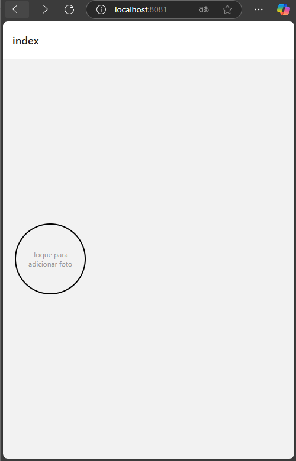
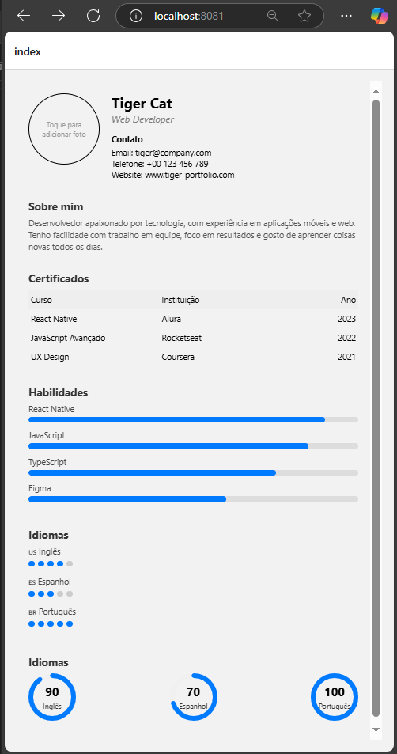
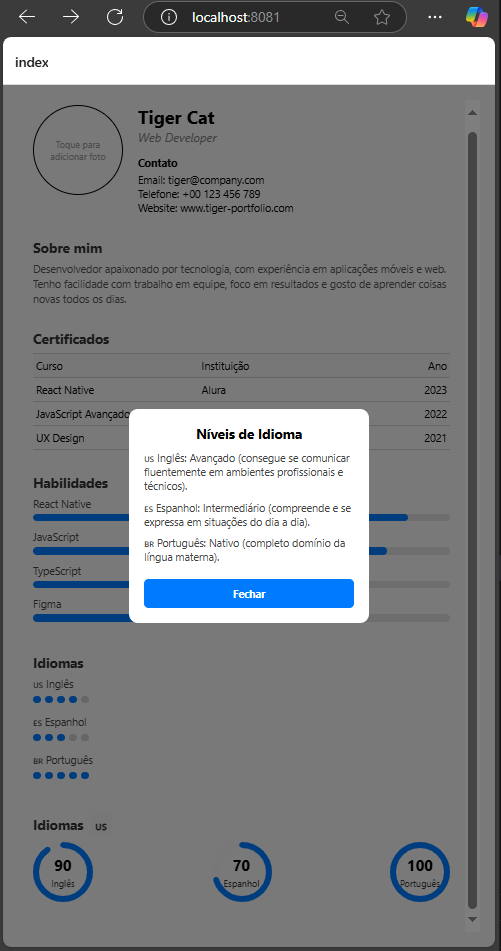
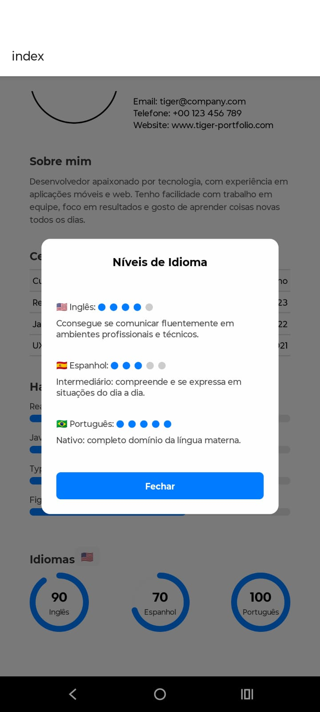

# Mobile-Introduction - CV-Online

# Objetivo: 
Este repositório tem como objetivo dar uma introdução rápida ao desenvolvimento de um app para dispositivos android com o foco em aplicações mobile. 

A ideia é de forma rápida e objetiva conseguir instalar e utilizar um app no celular.

Todo o guia vai ser baseado em react native em função de sua pratividade e facilidade na analise e aprendizado, além de ser um frameork bem aceito no mercado. 

## Pré Requisitos

Esta seção aborda os pré requisistos necessários para podermos proseguir com o aprendizado.

### Pré Requisitos

- [Expo - instalção no dispositivo mobile](https://expo.dev/go/)
- [Node.JS ](https://nodejs.org/en)
- [VS Code](https://code.visualstudio.com/)

Ajuste de politica de execução do PowerShell. Por padrão, o PowerShell não permite a execução de scripts não assinados, como o **npx**. Abaixo o comando para o determinado ajuste.

- Abrir o PowerShell como Administrador
- Pressione **Win + X** e selecione **"Windows PowerShell (Admin)"**.
- Ou procure por **"PowerShell"** no menu iniciar, clique com o botão direito e escolha **"Executar como Administrador"**.
- Digite o seguinte comando no PowerShell para permitir a execução de scripts locais:

```powershell
Set-ExecutionPolicy RemoteSigned -Scope CurrentUser
```

### Familizarização

Links de conhecimento relacionado ao TypeScript e ao React.

- [Introdução ao TS](https://www.typescriptlang.org/docs/handbook/2/everyday-types.html)
- [Introdução ao React](https://react.dev/learn) 

## 1 - Criando seu primeiro APP

### 1 Inicializar um novo aplicativo EXPO

Dentro do nosso terminal do VS Code, criaremos o nosso app através de uma linha de comando. Lembrando que aqui, temos que executar o comando extamente onde queremos que o projeto seja inicializado. 

obs: Recomendo que criem uma pasta na raiz do computador conforme modelo abaixo:

c:\desenvolvimento\mobile\

```sh
npx create-expo-app@latest cv-online
```
O comando vai criar um diretório usando um modelo padrão de app, com biblioteca essenciais. 

Algumas Vantagens de usar um modelo padrão para desenvolvimento:
- Cria um novo projeto React Native com expoo pacote instalado
- Inclui ferramentas recomendadas, como Expo CLI
- Inclui um navegador de abas do Expo Router para fornecer um sistema de navegação básico
- Configurado automaticamente para executar um projeto em várias plataformas: Android, iOS e web
TypeScript configurado por padrão

### 2 Script Reset

Como vamos criar o nosso aplicativo do zero, vamos resetar ele e com isto retirar alguns arquivos desnecessários. 

```sh
npm run reset-project
```

Com isto nossa pasta de APP fica com dois arquivos ( index.tsx e _layout.tsx ) os demais foram movidos para a pasta app-example. 

### 3 executando o aplicativo no Celular

Primeiramente executamos o comando abaixo para instalar as dependencias caso falte alguma relacionado ao ferramental do expo. 

```sh
npm install expo
npm install expo-router react-native-safe-area-context react-native-screens
npx expo install expo-image-picker
npx expo install react-native-svg
npm install react-native-circular-progress-indicator
```

Posterior iniciamos o nosso projeto com o comando abaixo.

```sh
npx expo start
```
Se no momento da instalação, aparecer uma mensagem solicitando a liberação do node.js no firewall do windoes, libere tanto para redes publicas como privadas. Este passo é bem iportante pois caso não configuremos estas permissoes, podemos ter impacto para emular o projeto. 

O comando acima iniciara o nosso servidor de desenvolvimento. Caso solicite para instalar alguma dependencia a mesma deve ser instalada.

Estado da nossa aplicação até o momento:


## 2 - Começando 

### 1 Entendendo CV-Onilne

Vamos criar um curriculo online com o intuito de utilizar alguns componentes do Ract Native, para praticar como atividade

A ideia é no futuro voces se desafiarem a transformar o curriculum segmentado por componentes ou até mesmo vocês podendo adicionar as competencias de forma dinamica.

### 2 Iniciando o desenvolvimento

Vamos seguir a seguinte estrutura para o nosso projeto conforme abaixo. Ainda não é necessário criar toda astrutura, ela vai ir evoluindo conforme formos realizando os fluxos do passo a passo. 

```java
cv-online/
├── app/
│   ├── index.tsx         <- Tela principal (Vamos colocar o tiger-game aqui)
│   ├── _layout.tsx
│   └── ...
├── ...
```

Primeiramente vamos realizar alguns ajustes simples na nossa tela inicial conforme código abaixo: 

```tsx
import { View, Text, Image, TouchableOpacity, StyleSheet } from 'react-native';
import { useState } from 'react';
import * as ImagePicker from 'expo-image-picker';

export default function HomeScreen() {
  const [image, setImage] = useState<string | null>(null);

  const pickImage = async () => {
    const result = await ImagePicker.launchImageLibraryAsync({
      mediaTypes: ImagePicker.MediaTypeOptions.Images,
      allowsEditing: true,
      aspect: [1, 1],
      quality: 1,
    });

    if (!result.canceled) {
      setImage(result.assets[0].uri);
    }
  };

  return (
    <View style={styles.container}>
      <TouchableOpacity onPress={pickImage}>
        <View style={styles.profileImageWrapper}>
          {image ? (
            <Image source={{ uri: image }} style={styles.profileImage} />
          ) : (
            <Text style={styles.placeholderText}>
              Toque para{'\n'}adicionar foto
            </Text>
          )}
        </View>
      </TouchableOpacity>
    </View>
  );
}

const styles = StyleSheet.create({
  container: {
    flex: 1,
    padding: 20,
    justifyContent: 'center',
    alignItems: 'flex-start',
  },
  profileImageWrapper: {
    width: 120,
    height: 120,
    borderRadius: 60,
    borderWidth: 2,
    borderColor: '#000',
    overflow: 'hidden',
    justifyContent: 'center',
    alignItems: 'center',
  },
  profileImage: {
    width: '100%',
    height: '100%',
    resizeMode: 'cover',
  },
  placeholderText: {
    color: '#999',
    textAlign: 'center',
    fontSize: 12,
  },
});


```


<details>
  <summary>🧠 O que esse código faz:</summary>

---
📦 1. Imports (importação de bibliotecas)

```tsx
import { View, Text, Image, TouchableOpacity, StyleSheet } from 'react-native';
import { useState } from 'react';
import * as ImagePicker from 'expo-image-picker';
```

- Traz componentes visuais do React Native (View, Text, Image, etc).
- useState: usado para guardar o estado da imagem.
- expo-image-picker: permite escolher uma imagem da galeria do celular.

---

🧠 2. Componente principal (HomeScreen)

```tsx

export default function HomeScreen() {
  const [image, setImage] = useState<string | null>(null);

```

- Cria um componente chamado HomeScreen.
- image: guarda o caminho (URI) da imagem escolhida. Começa como null (sem imagem).

---
📸 3. Função para escolher imagem da galeria

```ts
const pickImage = async () => {
  const result = await ImagePicker.launchImageLibraryAsync({
    mediaTypes: ImagePicker.MediaTypeOptions.Images,
    allowsEditing: true,
    aspect: [1, 1],
    quality: 1,
  });

  if (!result.canceled) {
    setImage(result.assets[0].uri);
  }
};
```

- Abre a galeria do celular.
- Permite cortar a imagem (quadrada 1:1).
- Se o usuário não cancelar, pega a imagem escolhida e salva seu caminho (URI) no estado.


---
🖼️ 4. Renderização da tela


```ts

return (
  <View style={styles.container}>
    <TouchableOpacity onPress={pickImage}>
      <View style={styles.profileImageWrapper}>
        {image ? (
          <Image source={{ uri: image }} style={styles.profileImage} />
        ) : (
          <Text style={styles.placeholderText}>
            Toque para{'\n'}adicionar foto
          </Text>
        )}
      </View>
    </TouchableOpacity>
  </View>
);

```

- Mostra um botão que é a imagem de perfil.
- Se uma imagem foi escolhida → exibe a imagem.
- Senão → mostra o texto "Toque para adicionar foto".

🎨 5. Estilos com StyleSheet


```tsx
const styles = StyleSheet.create({
  container: {
    flex: 1,
    padding: 20,
    justifyContent: 'center',
    alignItems: 'flex-start',
  },
  profileImageWrapper: {
    width: 120,
    height: 120,
    borderRadius: 60,
    borderWidth: 2,
    borderColor: '#000',
    overflow: 'hidden',
    justifyContent: 'center',
    alignItems: 'center',
  },
  profileImage: {
    width: '100%',
    height: '100%',
    resizeMode: 'cover',
  },
  placeholderText: {
    color: '#999',
    textAlign: 'center',
    fontSize: 12,
  },
});
```

- Define o visual da tela:
- container: centraliza o conteúdo.
- profileImageWrapper: círculo com borda onde a imagem vai.
- profileImage: imagem preenche o espaço.
- placeholderText: texto cinza centralizado.

</details>

Explicação simples de cada um dos elementos react utilizados. 


| **Elemento / Função**                   | **O que faz (Explicação simples)**                                                                 |
|----------------------------------------|----------------------------------------------------------------------------------------------------|
| `View`                                 | Contêiner genérico. Organiza e agrupa elementos. Como uma `div` no HTML.                          |
| `Text`                                 | Exibe texto na tela (mensagens, títulos, etc).                                                     |
| `Image`                                | Mostra uma imagem, pode ser da internet ou da galeria do celular.                                 |
| `TouchableOpacity`                     | Um botão que reage ao toque com leve transparência. Envolve qualquer conteúdo (imagem, texto).    |
| `StyleSheet.create({...})`            | Define os estilos visuais (cores, tamanhos, bordas etc).                                          |
| `useState(valorInicial)`              | Hook do React que guarda e atualiza valores (como a imagem escolhida).                            |
| `ImagePicker.launchImageLibraryAsync` | Abre a galeria do celular para escolher uma imagem.                                               |
| `ImagePicker.MediaTypeOptions.Images` | Diz que queremos **apenas imagens** (não vídeos, por exemplo).                                    |

Com isto temos o nosso curriculm organizado da seguinte maneira (Cliquem e selecionem uma imagem!! ): 



### 3 - Nossas Informações!

🎯 Etapa 3: Adicionando o bloco de informações ao lado da imagem

🧩 O que vamos fazer:

- Manter a imagem à esquerda.
- Adicionar um novo View com:
   - Nome
   - Cargo
   - Contato (email, telefone, site)
- Garantir que tudo fique alinhado no topo com alignItems: 'flex-start' e alignSelf: 'flex-start'.

O nosso código fonte vai ser alterado da seguinte maneira: 

```tsx
import { View, Text, Image, TouchableOpacity, StyleSheet } from 'react-native';
import { useState } from 'react';
import * as ImagePicker from 'expo-image-picker';

export default function HomeScreen() {
  const [image, setImage] = useState<string | null>(null);

  const pickImage = async () => {
    const result = await ImagePicker.launchImageLibraryAsync({
      mediaTypes: ImagePicker.MediaTypeOptions.Images,
      allowsEditing: true,
      aspect: [1, 1],
      quality: 1,
    });

    if (!result.canceled) {
      setImage(result.assets[0].uri);
    }
  };

  return (
    <View style={styles.container}>
      <View style={styles.topRow}>
        {/* Imagem */}
        <TouchableOpacity onPress={pickImage}>
          <View style={styles.profileImageWrapper}>
            {image ? (
              <Image source={{ uri: image }} style={styles.profileImage} />
            ) : (
              <Text style={styles.placeholderText}>
                Toque para{'\n'}adicionar foto
              </Text>
            )}
          </View>
        </TouchableOpacity>

        {/* Informações */}
        <View style={styles.infoBlock}>
          <Text style={styles.name}>Tiger Cat</Text>
          <Text style={styles.title}>Web Developer</Text>

          <View style={styles.contactSection}>
            <Text style={styles.contactTitle}>Contato</Text>
            <Text style={styles.contactText}>Email: tiger@company.com</Text>
            <Text style={styles.contactText}>Telefone: +00 123 456 789</Text>
            <Text style={styles.contactText}>Website: www.tiger-portfolio.com</Text>
          </View>
        </View>
      </View>
    </View>
  );
}

const styles = StyleSheet.create({
  container: {
    flex: 1,
    padding: 20,
  },
  topRow: {
    flexDirection: 'row',
    alignItems: 'flex-start',
  },
  profileImageWrapper: {
    width: 120,
    height: 120,
    borderRadius: 60,
    borderWidth: 2,
    borderColor: '#000',
    overflow: 'hidden',
    justifyContent: 'center',
    alignItems: 'center',
    marginRight: 20,
  },
  profileImage: {
    width: '100%',
    height: '100%',
    resizeMode: 'cover',
  },
  placeholderText: {
    color: '#999',
    textAlign: 'center',
    fontSize: 12,
  },
  infoBlock: {
    flex: 1,
    justifyContent: 'flex-start',
  },
  name: {
    fontSize: 24,
    fontWeight: 'bold',
  },
  title: {
    fontSize: 16,
    fontStyle: 'italic',
    color: 'gray',
    marginBottom: 10,
  },
  contactSection: {
    marginTop: 5,
  },
  contactTitle: {
    fontWeight: 'bold',
    marginBottom: 4,
  },
  contactText: {
    fontSize: 14,
  },
});

```

<details>
  <summary>🧠 O que esse código faz:</summary>

---
🆕 1. topRow (linha principal)

```tsx
<View style={styles.topRow}>
```

- Agrupa a imagem de perfil e as informações do lado direito.
- flexDirection: 'row' faz os elementos ficarem lado a lado (horizontalmente).

---
🆕 2. infoBlock (bloco de informações)

```tsx
<View style={styles.infoBlock}>
  <Text style={styles.name}>Tiger Cat</Text>
  <Text style={styles.title}>Web Developer</Text>
```

- Bloco ao lado da imagem com o nome e a profissão.
- name: texto grande e em negrito.
- title: texto menor, cinza e em itálico.

---

🆕 3. contactSection (contato)

```tsx
<View style={styles.contactSection}>
  <Text style={styles.contactTitle}>Contato</Text>
  <Text style={styles.contactText}>Email: tiger@company.com</Text>
  <Text style={styles.contactText}>Telefone: +00 123 456 789</Text>
  <Text style={styles.contactText}>Website: www.tiger-portfolio.com</Text>
</View>
```

- Parte de contato, com título e informações:
   - Email
   - Telefone
   - Website

---

🧑‍🎨 4. Estilos novos no StyleSheet

| **Estilo**         | **O que faz**                                                               |
|--------------------|-----------------------------------------------------------------------------|
| `topRow`           | Deixa os elementos (imagem e info) lado a lado.                            |
| `infoBlock`        | Bloco que contém o nome, título e informações de contato.                  |
| `name`             | Nome grande e em negrito.                                                   |
| `title`            | Profissão em itálico e cinza.                                               |
| `contactSection`   | Agrupa os textos de contato.                                                |
| `contactTitle`     | Título “Contato” em negrito.                                                |
| `contactText`      | Estilo comum para os dados (email, telefone, site), com fonte de tamanho 14. |


---
  </details>

---

✅ Resumo visual do que entrou:
   - 🖼️ Imagem à esquerda (já existia)
   - 🧾 Bloco à direita com:
      - Nome
      - Profissão
      - Seção de contato
---

### 4 - Sobre mim, você ou o Tiger! 

🧩 Etapa 4: Adicionando a seção Sobre mim (Vocês eheheh)
🧱 O que vamos fazer:
   - Criar uma seção abaixo da parte superior (imagem + dados).
   - Adicionar o título "Sobre mim" com destaque.
   - Adicionar um texto descritivo com espaçamento adequado.

📄 Atualizar no HomeScreen (trecho novo depois da topRow, tentem fazer para acoplar o código, vale a experiencia):

```tsx
      {/* Seção: Sobre mim */}
      <View style={styles.aboutSection}>
        <Text style={styles.sectionTitle}>Sobre mim</Text>
        <Text style={styles.aboutText}>
          Desenvolvedor apaixonado por tecnologia, com experiência em aplicações móveis e web.
          Tenho facilidade com trabalho em equipe, foco em resultados e gosto de aprender coisas novas todos os dias.
        </Text>
      </View>
```

✅ Estilos adicionados no StyleSheet.create:

```tsx

  aboutSection: {
    marginTop: 30,
  },
  sectionTitle: {
    fontSize: 18,
    fontWeight: 'bold',
    marginBottom: 8,
    color: '#333',
  },
  aboutText: {
    fontSize: 14,
    color: '#555',
    lineHeight: 20,
  },

```

---
🧠 Explicação:

| **Estilo**         | **Explicação**                                             |
|--------------------|------------------------------------------------------------|
| `marginTop: 30`    | Separa visualmente do topo                                 |
| `sectionTitle`     | Define a aparência do título “Sobre mim”                   |
| `aboutText`        | Define o texto com espaçamento e legibilidade              |

---

Nosso projeto até o momento:


### 5 - Mostrando os nossos certificados ao mundo! 

🧩 Etapa 4: Tabela de Certificados
🧱 O que vamos fazer:

- Criar um título: "Certificados".
- Criar um cabeçalho com as colunas: Curso, Instituição, Ano.

Adicionando a tabela com titulo e linhas, abaixo da seção "Sobre mim":

```tsx
{/* Seção: Certificados */}
      <View style={styles.certificatesSection}>
        <Text style={styles.sectionTitle}>Certificados</Text>

        {/* Cabeçalho da Tabela */}
        <View style={[styles.tableRow, styles.tableHeader]}>
          <Text style={[styles.tableCell, styles.cellCurso]}>Curso</Text>
          <Text style={[styles.tableCell, styles.cellInstituicao]}>Instituição</Text>
          <Text style={[styles.tableCell, styles.cellAno]}>Ano</Text>
        </View>

        {/* Linhas da Tabela */}
        <View style={styles.tableRow}>
          <Text style={[styles.tableCell, styles.cellCurso]}>React Native</Text>
          <Text style={[styles.tableCell, styles.cellInstituicao]}>Alura</Text>
          <Text style={[styles.tableCell, styles.cellAno]}>2023</Text>
        </View>
        <View style={styles.tableRow}>
          <Text style={[styles.tableCell, styles.cellCurso]}>JavaScript Avançado</Text>
          <Text style={[styles.tableCell, styles.cellInstituicao]}>Rocketseat</Text>
          <Text style={[styles.tableCell, styles.cellAno]}>2022</Text>
        </View>
        <View style={styles.tableRow}>
          <Text style={[styles.tableCell, styles.cellCurso]}>UX Design</Text>
          <Text style={[styles.tableCell, styles.cellInstituicao]}>Coursera</Text>
          <Text style={[styles.tableCell, styles.cellAno]}>2021</Text>
        </View>
      </View>
```

Criando a estilização

```tsx
  certificatesSection: {
    marginTop: 30,
  },
  tableRow: {
    flexDirection: 'row',
    paddingVertical: 6,
    borderBottomWidth: 1,
    borderBottomColor: '#ccc',
  },
  tableHeader: {
    backgroundColor: '#eee',
    borderTopWidth: 1,
    borderTopColor: '#ccc',
  },
  tableCell: {
    fontSize: 14,
    paddingHorizontal: 4,
  },
  cellCurso: {
    flex: 2,
  },
  cellInstituicao: {
    flex: 2,
  },
  cellAno: {
    flex: 1,
    textAlign: 'right',
  },

```
---

✅ O que está acontecendo aqui:

| Elemento      | Explicação                                                                 |
|---------------|-----------------------------------------------------------------------------|
| `tableRow`    | Define cada linha da "tabela"                                               |
| `tableHeader` | Dá um fundo diferente para o cabeçalho                                      |
| `tableCell`   | Estilo base das células                                                    |
| `flex: 2 / 1` | Distribui o espaço de forma proporcional (flex: 2 para cursos, flex: 1 para ano) |
| `textAlign: 'right'` | Alinha o ano à direita                                                     |

---

### 6 - Habilidades com barras de progresso

🧩 Etapa 6: Seção de Habilidades com Barras de Progresso
🧱 O que vamos fazer:
- Adicionar o título "Habilidades".
- Listar algumas skills (React Native, JavaScript, etc.).
- Representar o nível com uma barra de preenchimento proporcional.

📄 Adicione isso abaixo da seção "Certificados":

```tsx

      {/* Seção: Habilidades */}
      <View style={styles.skillsSection}>
        <Text style={styles.sectionTitle}>Habilidades</Text>

        {/* Exemplo de Habilidade */}
        <View style={styles.skillItem}>
          <Text style={styles.skillLabel}>React Native</Text>
          <View style={styles.progressBar}>
            <View style={[styles.progressFill, { width: '90%' }]} />
          </View>
        </View>

        <View style={styles.skillItem}>
          <Text style={styles.skillLabel}>JavaScript</Text>
          <View style={styles.progressBar}>
            <View style={[styles.progressFill, { width: '85%' }]} />
          </View>
        </View>

        <View style={styles.skillItem}>
          <Text style={styles.skillLabel}>TypeScript</Text>
          <View style={styles.progressBar}>
            <View style={[styles.progressFill, { width: '75%' }]} />
          </View>
        </View>

        <View style={styles.skillItem}>
          <Text style={styles.skillLabel}>Figma</Text>
          <View style={styles.progressBar}>
            <View style={[styles.progressFill, { width: '60%' }]} />
          </View>
        </View>
      </View>

```

🎨 Adicione os estilos abaixo no StyleSheet.create:

```tsx
  skillsSection: {
    marginTop: 30,
  },
  skillItem: {
    marginBottom: 12,
  },
  skillLabel: {
    fontSize: 14,
    marginBottom: 4,
    color: '#444',
  },
  progressBar: {
    height: 10,
    backgroundColor: '#ddd',
    borderRadius: 5,
    overflow: 'hidden',
  },
  progressFill: {
    height: '100%',
    backgroundColor: '#007AFF',
    borderRadius: 5,
  },
```

---

✅ Explicação rápida:

| Componente     | Explicação                                        |
|----------------|----------------------------------------------------|
| `progressBar`  | Barra de fundo cinza                              |
| `progressFill` | Preenchimento colorido com % conforme nível       |
| `width: '90%'` | Define o nível da skill, preenchendo a barra      |
---

Observação: Podemos alterar os valores ('90%', '60%', etc.) conforme quiser destacar o nível de cada habilidade!

### 7 - Adicionando uma barra de rolagem

Estamos com um problema na nossa aplicação, pois a mesma não esta rolando o conteudo, e como resolvemos isto? 

A gente precisa trocar o componente View que está envolvendo todo o conteúdo principal por um ScrollView.

🛠️ Passo a passo:
Importe o ScrollView no topo do seu arquivo:

```tsx
import { ScrollView } from 'react-native';
```

Substitua a View que envolve tudo (geralmente após o SafeAreaView) por um ScrollView:

```tsx
<SafeAreaView style={styles.container}>
  <ScrollView contentContainerStyle={styles.scrollContainer}>
    {/* todo o conteúdo vai aqui dentro */}
  </ScrollView>
</SafeAreaView>
```

No seu StyleSheet, adicione um estilo para o scrollContainer:

```tsx
  scrollContainer: {
    padding: 20,
    paddingBottom: 40,
  },
```

Isso garante que o conteúdo role corretamente e que não fique colado no final.

### 8 - Adicionando idiomas

Vamos adicionar duas seções de idiomas, uma em nivel e outra em barra cirtular. 
- Mas poruque repetir? 
- Pq depois vamos criar uma modal para mostrar um dos dois formatos neste estilo.

---
🧩 Idiogma por bnível
Círculos preenchidos por nível (de 1 a 5)

```plaintext
🇺🇸 Inglês      ● ● ● ● ○
🇪🇸 Espanhol    ● ● ● ○ ○
🇧🇷 Português   ● ● ● ● ●
```

Vamos adicionar o seguinte bloco de código abaixo do nível de habilidade.

```tsx
      {/* Seção: Idiomas */}
      <View style={styles.languagesSection}>
        <Text style={styles.sectionTitle}>Idiomas</Text>

        <View style={styles.languageItem}>
          <Text style={styles.languageLabel}>🇺🇸 Inglês</Text>
          <View style={styles.dotsRow}>
            {[1, 2, 3, 4, 5].map((i) => (
              <View
                key={i}
                style={[styles.dot, i <= 4 ? styles.dotFilled : styles.dotEmpty]}
              />
            ))}
          </View>
        </View>

        <View style={styles.languageItem}>
          <Text style={styles.languageLabel}>🇪🇸 Espanhol</Text>
          <View style={styles.dotsRow}>
            {[1, 2, 3, 4, 5].map((i) => (
              <View
                key={i}
                style={[styles.dot, i <= 3 ? styles.dotFilled : styles.dotEmpty]}
              />
            ))}
          </View>
        </View>

        <View style={styles.languageItem}>
          <Text style={styles.languageLabel}>🇧🇷 Português</Text>
          <View style={styles.dotsRow}>
            {[1, 2, 3, 4, 5].map((i) => (
              <View
                key={i}
                style={[styles.dot, styles.dotFilled]}
              />
            ))}
          </View>
        </View>
      </View>

```

E o seguinte estilo:

```tsx
  languagesSection: {
    marginTop: 30,
  },
  languageItem: {
    marginBottom: 16,
  },
  languageLabel: {
    fontSize: 14,
    marginBottom: 6,
    color: '#444',
  },
  dotsRow: {
    flexDirection: 'row',
    gap: 6,
  },
  dot: {
    width: 10,
    height: 10,
    borderRadius: 5,
  },
  dotFilled: {
    backgroundColor: '#007AFF',
  },
  dotEmpty: {
    backgroundColor: '#ccc',
  },

```

✅ O que acontece aqui:

| Componente        | Função                                              |
|-------------------|-----------------------------------------------------|
| `dotsRow`         | Linha de bolinhas para representar nível            |
| `dotFilled` / `dotEmpty` | Mostra ou oculta o preenchimento             |
| `map`             | Gera 5 círculos, com base no nível do idioma        |


---

---

🧩 Idiomas com Gráficos Circulares

Primeiramente realizamos a importação do CircularProgress

```tsx
import CircularProgress from 'react-native-circular-progress-indicator';
```

Posterior ao nosso idioma com lvl, adicionamos o nosso idioma circular

```tsx
{/* Seção: Idiomas com gráfico circular */}
<View style={styles.languagesSection}>
  <Text style={styles.sectionTitle}>Idiomas</Text>

  <View style={styles.languagesRow}>
    <View style={styles.languageCircle}>
      <CircularProgress
        value={90}
        radius={40}
        duration={1000}
        progressValueColor={'#000'}
        activeStrokeColor={'#007AFF'}
        inActiveStrokeColor={'#eee'}
        inActiveStrokeOpacity={0.4}
        title={'Inglês'}
        titleColor={'#333'}
        titleStyle={{ fontSize: 12 }}
      />
    </View>

    <View style={styles.languageCircle}>
      <CircularProgress
        value={70}
        radius={40}
        duration={1000}
        progressValueColor={'#000'}
        activeStrokeColor={'#007AFF'}
        inActiveStrokeColor={'#eee'}
        inActiveStrokeOpacity={0.4}
        title={'Espanhol'}
        titleColor={'#333'}
        titleStyle={{ fontSize: 12 }}
      />
    </View>

    <View style={styles.languageCircle}>
      <CircularProgress
        value={100}
        radius={40}
        duration={1000}
        progressValueColor={'#000'}
        activeStrokeColor={'#007AFF'}
        inActiveStrokeColor={'#eee'}
        inActiveStrokeOpacity={0.4}
        title={'Português'}
        titleColor={'#333'}
        titleStyle={{ fontSize: 12 }}
      />
    </View>
  </View>
</View>
```

Posterior adicionamos mais estilos:
Caso algum estilo se repetia, exclua um. 

```tsx
  languagesSection: {
    marginTop: 30,
  },
  languagesRow: {
    flexDirection: 'row',
    justifyContent: 'space-between',
    flexWrap: 'wrap',
    gap: 20,
  },
  languageCircle: {
    alignItems: 'center',
    justifyContent: 'center',
  },
```

📌 Resultado
Veremos os três idiomas lado a lado, cada um com um círculo de progresso animado, título e porcentagem de fluência!

---

Vamos ver como está a nossa aplicação até com os idiomas:




### 9 - Cirando uma modal

Vamos criar uma modal para guardar os idiomas em lvl. 

Para isto vamos criar um botao ao lado do idioma em circulo e ao clicar, vamos ver os idiomas por lvl. 

Etapa 1: Vamos adicionar um botão ao lado do título "Idiomas" (barra circular)

Vamos alterar essa parte:

```tsx
<Text style={styles.sectionTitle}>Idiomas</Text>
```
Vamos mudar para (Observe que o botao está junto com o texto):

```tsx
      {/* Seção: Idiomas com gráfico circular */}
      <View style={styles.languagesSection}>
      <View style={styles.sectionTitleRow}>
        <Text style={styles.sectionTitle}>Idiomas
        <TouchableOpacity onPress={() => setModalVisible(true)} style={styles.infoButton}>
            <Text style={styles.infoButtonText}>🇺🇸</Text>      
          </TouchableOpacity>
        </Text>  
      </View>
       {/* Circles aqui */}
```

Adicionamos os seguintes estilos:

```tsx
sectionTitleRow: {
  flexDirection: 'row',
  alignItems: 'center',
  justifyContent: 'space-between',
},
infoButton: {
  fontSize: 18,
  paddingHorizontal: 8,
},
```

Vamos adicionar nas constantes o seguinte código

```tsx
const [modalVisible, setModalVisible] = useState(false);
```
E ao final do nosso código fora da  vamos adicionar a nossa modal:

<details>
<summary>Explicação da modal.</summary>

Essa modal é um componente que aparece somente quando a variável modalVisible é true. Ela exibe uma caixa centralizada com informações sobre os níveis de idioma do usuário (Inglês, Espanhol e Português), cada um com uma pequena descrição e um emoji correspondente. O fundo da tela é escurecido com um View chamado modalOverlay, enquanto o conteúdo principal da modal fica dentro de modalContent, que é a caixa branca visível ao centro. No final, há um botão com o texto "Fechar" que, ao ser pressionado, fecha a modal alterando o valor de modalVisible para false.

</details>

```tsx
      {modalVisible && (
  <View style={styles.modalOverlay}>
    <View style={styles.modalContent}>
      <Text style={styles.modalTitle}>Níveis de Idioma</Text>
      <Text style={styles.modalText}>
        🇺🇸 Inglês: Avançado (consegue se comunicar fluentemente em ambientes profissionais e técnicos).
      </Text>
      <Text style={styles.modalText}>
        🇪🇸 Espanhol: Intermediário (compreende e se expressa em situações do dia a dia).
      </Text>
      <Text style={styles.modalText}>
        🇧🇷 Português: Nativo (completo domínio da língua materna).
      </Text>
      <TouchableOpacity onPress={() => setModalVisible(false)} style={styles.modalCloseButton}>
        <Text style={styles.modalCloseText}>Fechar</Text>
      </TouchableOpacity>
    </View>
  </View>
)}
```


Posterior adicionamos os seguintes estilos:

```tsx
languagesHeader: {
  flexDirection: 'row',
  alignItems: 'center',
  marginBottom: 10,
},
infoButton: {
  marginLeft: 8,
  backgroundColor: '#eee',
  paddingHorizontal: 8,
  paddingVertical: 4,
  borderRadius: 6,
},
infoButtonText: {
  fontSize: 16,
},

modalOverlay: {
  position: 'absolute',
  top: 0,
  left: 0,
  right: 0,
  bottom: 0,
  backgroundColor: 'rgba(0,0,0,0.5)',
  justifyContent: 'center',
  alignItems: 'center',
  padding: 20,
},
modalContent: {
  backgroundColor: '#fff',
  padding: 20,
  borderRadius: 12,
  width: '100%',
  maxWidth: 320,
},
modalTitle: {
  fontSize: 18,
  fontWeight: 'bold',
  marginBottom: 12,
  textAlign: 'center',
},
modalText: {
  fontSize: 14,
  color: '#444',
  marginBottom: 10,
},
modalCloseButton: {
  marginTop: 10,
  backgroundColor: '#007AFF',
  padding: 10,
  borderRadius: 6,
},
modalCloseText: {
  color: '#fff',
  textAlign: 'center',
  fontWeight: 'bold',
},
```

Com isto estamos com o seguinte comportamento no nosso curriculo:



### 10 - Adaptando a nossa modal ao idioma

Vamos retirar o bloco de código dos idiomas e levar até a nossa modal la no final do arquivo. Recortar o treecho abaixo
```tsx
        {/* Seção: Idiomas */}
      <View style={styles.languagesSection}>
        <Text style={styles.sectionTitle}>Idiomas</Text>

        <View style={styles.languageItem}>
          <Text style={styles.languageLabel}>🇺🇸 Inglês</Text>
          <View style={styles.dotsRow}>
            {[1, 2, 3, 4, 5].map((i) => (
              <View
                key={i}
                style={[styles.dot, i <= 4 ? styles.dotFilled : styles.dotEmpty]}
              />
            ))}
          </View>
        </View>

        <View style={styles.languageItem}>
          <Text style={styles.languageLabel}>🇪🇸 Espanhol</Text>
          <View style={styles.dotsRow}>
            {[1, 2, 3, 4, 5].map((i) => (
              <View
                key={i}
                style={[styles.dot, i <= 3 ? styles.dotFilled : styles.dotEmpty]}
              />
            ))}
          </View>
        </View>

        <View style={styles.languageItem}>
          <Text style={styles.languageLabel}>🇧🇷 Português</Text>
          <View style={styles.dotsRow}>
            {[1, 2, 3, 4, 5].map((i) => (
              <View
                key={i}
                style={[styles.dot, styles.dotFilled]}
              />
            ))}
          </View>
        </View>
      </View>
```

Na modal, vamos fazer a seguinte adaptação:


```tsx
{modalVisible && (
        <View style={styles.modalOverlay}>
          <View style={styles.modalContent}>
            <Text style={styles.modalTitle}>Níveis de Idioma</Text>

            {/* Seção: Idiomas */}
            <View style={styles.languagesSection}>
              <View style={styles.languageItem}>
                <Text style={styles.languageLabel}>
                  🇺🇸 Inglês:{" "}
                  <View style={styles.dotsRow}>
                    {[1, 2, 3, 4, 5].map((i) => (
                      <View
                        key={i}
                        style={[
                          styles.dot,
                          i <= 4 ? styles.dotFilled : styles.dotEmpty,
                        ]}
                      />
                    ))}
                  </View>
                </Text>
                <Text style={styles.modalText}>
                  Cconsegue se comunicar fluentemente em ambientes profissionais
                  e técnicos.
                </Text>
              </View>

              <View style={styles.languageItem}>
                <Text style={styles.languageLabel}>
                  🇪🇸 Espanhol:{" "}
                  <View style={styles.dotsRow}>
                    {[1, 2, 3, 4, 5].map((i) => (
                      <View
                        key={i}
                        style={[
                          styles.dot,
                          i <= 3 ? styles.dotFilled : styles.dotEmpty,
                        ]}
                      />
                    ))}
                  </View>
                </Text>

                <Text style={styles.modalText}>
                  Intermediário: compreende e se expressa em situações do dia a
                  dia.
                </Text>
              </View>

              <View style={styles.languageItem}>
                <Text style={styles.languageLabel}>
                  🇧🇷 Português:{" "}
                  <View style={styles.dotsRow}>
                    {[1, 2, 3, 4, 5].map((i) => (
                      <View key={i} style={[styles.dot, styles.dotFilled]} />
                    ))}
                  </View>
                </Text>

                <Text style={styles.modalText}>
                  Nativo: completo domínio da língua materna.
                </Text>
              </View>
            </View>
            <TouchableOpacity
              onPress={() => setModalVisible(false)}
              style={styles.modalCloseButton}
            >
              <Text style={styles.modalCloseText}>Fechar</Text>
            </TouchableOpacity>
          </View>
        </View>
      )}
```

Por mais que a modal esteja com o um código grande, ela nos ajuda a organizar conteudos dentro das nossa aplicações.



### 11 Componentes


Agora vamos criar dois componentes para serem as nossas experiencias profissionais e as nossas formações. Ao final desta sessão vocês veram, como é mais facil trabalhar com componentes

Primeiramente vamos criar uma pasta chamada component na raiz do nosso cv-online


Posterior vamos criar dois arquivos dentro desta pasta com os seguintes nome:

- ExperienciaItem.tsx        <- comopnent da experiencia profissional
- FormacaoItem.tsx

```java
cv-onilne/
├── app/
│   ├── index.tsx         <- Tela principal (Vamos colocar o cv-online aqui)
│   ├── _layout.tsx
│   └── ...
├── component
│   ├── ExperienciaItem.tsx        <- comopnent da experiencia profissional
│   ├── FormacaoItem.tsx           <- comopnent da formação profissional
└── ......
```

Segue abaixo os códigos de ambos os componentes:

🧩 1. Componente ExperienciaItem.tsx

```tsx
import { View, Text, StyleSheet } from "react-native";

type Props = {
  cargo: string;
  empresa: string;
  periodo: string;
  descricao: string;
};

export default function ExperienciaItem({
  cargo,
  empresa,
  periodo,
  descricao,
}: Props) {
  return (
    <View style={styles.container}>
      <Text style={styles.cargo}>{cargo}</Text>
      <Text style={styles.empresa}>{empresa} • {periodo}</Text>
      <Text style={styles.descricao}>{descricao}</Text>
    </View>
  );
}

const styles = StyleSheet.create({
  container: {
    marginBottom: 16,
  },
  cargo: {
    fontSize: 16,
    fontWeight: "bold",
    color: "#333",
  },
  empresa: {
    fontSize: 14,
    color: "#666",
    marginBottom: 4,
  },
  descricao: {
    fontSize: 14,
    color: "#555",
    lineHeight: 20,
  },
});
```
<details>
<summary>🧩 ExperienciaItem.tsx — Explicação </summary>


---
 📦 Importações

```tsx
import { View, Text, StyleSheet } from "react-native";
```

- Importa componentes básicos da interface (View, Text) e o sistema de estilos (StyleSheet) do React Native.

---

📌 Tipagem das props

```tsx
type Props = {
  cargo: string;
  empresa: string;
  periodo: string;
  descricao: string;
};
```

Define o que o componente espera receber:
- cargo: o nome do cargo/função.
- empresa: onde a pessoa trabalhou.
- periodo: o tempo em que trabalhou lá.
- descricao: o que ela fazia nesse cargo.

---

🧱 Estrutura do componente

```tsx

export default function ExperienciaItem({ cargo, empresa, periodo, descricao }: Props) {
  return (
    <View style={styles.container}>
      <Text style={styles.cargo}>{cargo}</Text>
      <Text style={styles.empresa}>{empresa} • {periodo}</Text>
      <Text style={styles.descricao}>{descricao}</Text>
    </View>
  );
}
```

Cria um bloco com três textos:
- Cargo em destaque.
- Nome da empresa + período.
- Descrição das atividades.

--- 
🎨 Estilo do componente

```tsx
const styles = StyleSheet.create({
  container: { marginBottom: 16 },
  cargo: { fontSize: 16, fontWeight: "bold", color: "#333" },
  empresa: { fontSize: 14, color: "#666", marginBottom: 4 },
  descricao: { fontSize: 14, color: "#555", lineHeight: 20 },
});
```
- Define um espaçamento entre itens e estilos diferentes para cada linha de texto.

</details>


🎓 2. Componente FormacaoItem.tsx

```tsx
import { View, Text, StyleSheet } from "react-native";

type Props = {
  curso: string;
  instituicao: string;
  ano: string;
};

export default function FormacaoItem({ curso, instituicao, ano }: Props) {
  return (
    <View style={styles.container}>
      <Text style={styles.curso}>{curso}</Text>
      <Text style={styles.instituicao}>
        {instituicao} • {ano}
      </Text>
    </View>
  );
}

const styles = StyleSheet.create({
  container: {
    marginBottom: 16,
  },
  curso: {
    fontSize: 16,
    fontWeight: "bold",
    color: "#333",
  },
  instituicao: {
    fontSize: 14,
    color: "#666",
  },
});
```

<details>
<summary>🧩 🎓 FormacaoItem.tsx — Explicação </summary>


---
 📦 Importações

```tsx
import { View, Text, StyleSheet } from "react-native";

```

- Mesma ideia: importa o que é necessário para construir e estilizar.

---

📌 Tipagem das props

```tsx
type Props = {
  curso: string;
  instituicao: string;
  ano: string;
};
```
Espera receber:
- curso: nome do curso ou graduação.
- instituicao: onde estudou.
- ano: ano de conclusão ou período.

---

🧱 Estrutura do componente

```tsx
export default function FormacaoItem({ curso, instituicao, ano }: Props) {
  return (
    <View style={styles.container}>
      <Text style={styles.curso}>{curso}</Text>
      <Text style={styles.instituicao}>
        {instituicao} • {ano}
      </Text>
    </View>
  );
}

```

Mostra duas linhas:
- Nome do curso em destaque.
- Nome da instituição + ano.

--- 
🎨 Estilo do componente

```tsx
const styles = StyleSheet.create({
  container: { marginBottom: 16 },
  curso: { fontSize: 16, fontWeight: "bold", color: "#333" },
  instituicao: { fontSize: 14, color: "#666" },
});

```
- Estilização parecida com o componente de experiência, mas um pouco mais simples (sem descrição longa).

</details>

✅ **Resumo visual**

| Componente       | Mostra o quê?          | Linhas principais                        |
|------------------|------------------------|------------------------------------------|
| `ExperienciaItem`| Cargo profissional     | Cargo, empresa + período, descrição      |
| `FormacaoItem`   | Formação acadêmica     | Curso, instituição + ano    

### 12 - Adicionanodo nosso componentes a nossa home:

Agora vamos adicionar as nossas informações em formato de componente

Primeiramente realizamos os imports dos componentes que acabamos de criar: 

```tsx
import ExperienciaItem from "../components/ExperienciaItem";
import FormacaoItem from "../components/FormacaoItem";
```

Em seguida adicionamos as nossas experiencias/formações como e código abaixo:

```tsx
{/* Linha divisória */}
          <View style={styles.divisor} />
          {/* Seção: Experiência Profissional */}
          <View style={styles.experienciaSection}>
            <Text style={styles.sectionTitle}>Experiência Profissional</Text>
            <ExperienciaItem
              cargo="Desenvolvedor Front-End"
              empresa="Tech Company"
              periodo="2021 - Presente"
              descricao="Responsável pelo desenvolvimento de interfaces web e mobile com React e React Native."
            />
            <ExperienciaItem
              cargo="Estagiário de Desenvolvimento"
              empresa="Startup XYZ"
              periodo="2020 - 2021"
              descricao="Participação em projetos ágeis, criação de protótipos e manutenção de sistemas."
            />
          </View>
          {/* Linha divisória */}
          <View style={styles.divisor} />
          {/* Seção: Formação Acadêmica */}
          <View style={styles.formacaoSection}>
            <Text style={styles.sectionTitle}>Formação Acadêmica</Text>
            <FormacaoItem
              curso="Análise e Desenvolvimento de Sistemas"
              instituicao="Universidade Federal"
              ano="2020 - 2023"
            />
            <FormacaoItem
              curso="Técnico em Informática"
              instituicao="Escola Técnica"
              ano="2017 - 2019"
            />
          </View>
          {/* Linha divisória */}
          <View style={styles.divisor} />
```

E por fim adicionamos os estilos necessários:

```tsx
experienciaSection: {
  marginTop: 30,
},
formacaoSection: {
  marginTop: 30,
},
divisor: {
  height: 1,
  backgroundColor: "#ccc",
  marginVertical: 24,
},
```


<details>
<summary>Analisando o componente e seu funcionamento</summary>

🔹 ExperienciaItem

- Esse componente exibe uma experiência profissional. 
- Cada item mostra:
   - Cargo (ex: Desenvolvedor Front-End)
   - Empresa e período (ex: Tech Company – 2021 a presente)
   - Descrição das atividades realizadas

✅ Exemplo:

```tsx
<ExperienciaItem
  cargo="Desenvolvedor Front-End"
  empresa="Tech Company"
  periodo="2021 - Presente"
  descricao="Responsável pelo desenvolvimento de interfaces web e mobile com React e React Native."
/>
```
🔹 FormacaoItem

- Esse componente exibe uma formação acadêmica. 
- Cada item mostra:
   - Curso (ex: Análise e Desenvolvimento de Sistemas)
   - Instituição (ex: Universidade Federal)
   - Ano ou período (ex: 2020 – 2023)

✅ Exemplo:

```tsx
<FormacaoItem
  curso="Análise e Desenvolvimento de Sistemas"
  instituicao="Universidade Federal"
  ano="2020 - 2023"
/>
```

🔹 View style={styles.divisor}
Essa linha representa um divisor visual (tipo uma linha separadora). Ele é usado para organizar visualmente a tela, separando seções como experiência e formação.

```tsx
<View style={styles.divisor} /
```

</details>

### 13 -  é quase o fim? 

Vamos criar um botão para gerar um pdf da nossa página!

Vamos ajusta a nomenclatura da nossa home, ajustando o arquivo _layout.tsx

```tsx
import { Stack } from 'expo-router';

export default function Layout() {
  return (
    <Stack>
      <Stack.Screen 
        name="index" 
        options={{ title: 'CV-Online' }} 
      />
    </Stack>
  );
}

```

Vamos ajustar tmb o icone da nossa aplicação:

Dentro do app.json, realizamos o ajuste dos icones do projeto(coloquei o icone cv-online). Fiz o icone pelo site [easyappicon](https://easyappicon.com/) 


```tsx
{
  "expo": {
    "name": "cv-online",
    "slug": "cv-online",
    "version": "1.0.0",
    "orientation": "portrait",
    "icon": "./assets/images/cv-online.png",
    "scheme": "myapp",
    "userInterfaceStyle": "automatic",
    "newArchEnabled": true,
    "ios": {
      "supportsTablet": true
    },
    "android": {
      "adaptiveIcon": {
        "foregroundImage": "./assets/images/cv-online.png",
        "backgroundColor": "#ffffff"
      }
    },
    "web": {
      "bundler": "metro",
      "output": "static",
      "favicon": "./assets/images/favicon.png"
    },
    "plugins": [
      "expo-router",
      [
        "expo-splash-screen",
        {
          "image": "./assets/images/cv-online.png",
          "imageWidth": 200,
          "resizeMode": "contain",
          "backgroundColor": "#ffffff"
        }
      ]
    ],
    "experiments": {
      "typedRoutes": true
    }
  }
}

```

Com isto estamos preparado para buildar o nosso curriculum, mas antes vamos ver como ele está em sua versão final:


### 14 Gerando um apk do CV-Online

Nos passos 13 em diante vamos deixar a nossa calculadora mais bonita.
Mas de momento vamos ver a nossa calculadora funcionando diretamente no nosso celular através de um apk.

#### 1 Buildando um apk

---
Antes de continuarmos, devemos criar uma conta na plataforma [EAS](https://expo.dev/signup).(Caso ja tenha conta, pode igonrar esse passo)

Posterior necessitamos intalar o pacote de build do expo. O comando abaixo instala de forma global(Caso ja tenha instalado, pode igonrar esse passo)

```sh
npm install -g eas-cli
```

Logamos na plataforma eas com o seguinte comando
Colocamos usuário e senha criado nos passos anteriores.

```sh
eas login
```

Geramos a configuração do projeto:

```sh
eas build:configure
```

Alteramos o arquivo eas.json criado com as seguintes configurações: 

```json
{
  "build": {
    "preview": {
      "android": {
        "buildType": "apk"
      }
    }
  }
}
```

Posterior buildamos o nosso apk com o seguinte comando: 
Observação: O processo demora em função de estarmos com uma licença free para build na plataforma EAS.

```sh
eas build --profile preview --platform android
```


#### 2 Instalando o app no celular

Pegamos o arquivo gerado através da URL do build. O mesmo vai entregar um arquivo.apk.

Posterior, enviamos esta arquivo APK para o nosso android via drive ou outra ferramenta de escolha. 

Ao final, instalamos o mesmo em nosso celular. Para a instalação ser possível o android tem que estar em modo desenvolvedor e o apk em diretório local.
---

### 15 - Desafio!!

Desafio consiste em transformar todo o curriculum em componente, assim como a etapa final da experiencia e Formatação.


# cv-online
